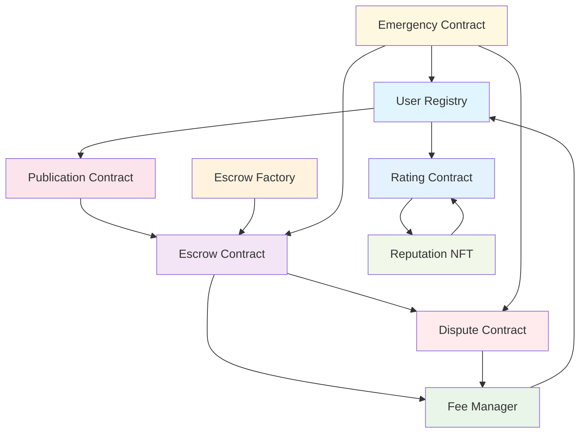

# Smart Contracts Overview

## Introduction

The Offer Hub platform is powered by a comprehensive suite of Soroban smart contracts that work together to create a secure, decentralized freelance marketplace. This document provides an architectural overview of how all contracts interact to deliver platform functionality.

## Contract Architecture



## Core Contracts

### 1. User Registry Contract
**Purpose:** Foundational identity and access control system

**Key Features:**
- Multi-level user verification (Basic, Premium, Enterprise)
- Blacklist management for malicious users
- Admin and moderator role management
- Bulk operations for administrative efficiency

**Integration:** All other contracts reference user verification status

---

### 2. Escrow Contract
**Purpose:** Secure payment management between clients and freelancers

**Key Features:**
- Milestone-based payment system
- Dispute integration with automatic resolution
- Fee calculation and collection
- Auto-release functionality with timeout

**Integration:** Central to payment flows, integrates with Fee Manager and Dispute contracts

---

### 3. Escrow Factory
**Purpose:** Standardized deployment and management of escrow contracts

**Key Features:**
- Batch escrow deployment from WASM
- Centralized contract management
- Batch operations across multiple escrows
- Archive system for completed contracts

**Integration:** Creates and manages Escrow Contract instances

---

### 4. Dispute Resolution Contract
**Purpose:** Two-tier mediation and arbitration system

**Key Features:**
- Mediation → Arbitration escalation process
- Evidence submission with IPFS support
- Timeout-based automatic resolution
- Direct escrow integration for fund release

**Integration:** Called by Escrow contracts for conflict resolution

---

### 5. Fee Manager Contract
**Purpose:** Centralized fee calculation and collection

**Key Features:**
- Configurable fee rates for different operations
- Premium user exemptions
- Transparent fee calculation
- Platform balance management

**Integration:** Used by all contracts requiring fee processing

## Supporting Contracts

### 6. Publication Contract
**Purpose:** On-chain registry for services and projects

**Key Features:**
- Decentralized publication registry
- User-specific publication counters
- Data validation and event emission
- Off-chain indexing support

**Integration:** First step in project creation workflow

---

### 7. Reputation NFT Contract
**Purpose:** Achievement-based NFT system

**Key Features:**
- Automatic achievement minting based on ratings
- Milestone-based rewards
- Integration with rating system
- IPFS metadata storage

**Integration:** Triggered by Rating Contract achievements

---

### 8. Rating Contract
**Purpose:** User rating and feedback system

**Key Features:**
- Rating submission and aggregation
- Anti-spam and validation measures
- Statistics calculation
- Achievement trigger integration

**Integration:** Feeds data to Reputation NFT contract

---

### 9. Emergency Contract
**Purpose:** Platform safety and crisis management

**Key Features:**
- Emergency pause/unpause functionality
- Circuit breaker protection
- Fund recovery system
- Emergency contact network

**Integration:** Can pause all other contracts during emergencies

## Contract Interaction Flows

### 1. Project Creation Flow
```
User → Publication Contract (publish project)
     → Escrow Factory (deploy escrow)
     → Escrow Contract (initialize)
     → Fee Manager (calculate fees)
```

### 2. Payment Flow
```
Client → Escrow Contract (deposit funds)
       → Fee Manager (collect fees)
       → Escrow Contract (milestone management)
       → Freelancer (release funds)
```

### 3. Dispute Flow
```
Client/Freelancer → Dispute Contract (open dispute)
                 → Evidence submission
                 → Mediation/Arbitration
                 → Escrow Contract (resolve payment)
                 → Fee Manager (collect dispute fees)
```

### 4. Reputation Flow
```
Client/Freelancer → Rating Contract (submit rating)
                 → Reputation NFT (check achievements)
                 → Auto-mint NFTs for milestones
                 → Update user reputation score
```

### 5. Emergency Flow
```
Emergency Admin → Emergency Contract (pause/unpause)
               → All Contracts (check pause status)
               → Circuit Breaker (automatic protection)
               → Fund Recovery (stuck fund resolution)
```

## Data Flow Between Contracts

### User Verification Chain
1. **User Registry** verifies users
2. **All contracts** check verification status
3. **Fee Manager** applies premium user discounts
4. **Emergency Contract** can blacklist users

### Payment Processing Chain
1. **Publication Contract** creates project record
2. **Escrow Factory** deploys payment contract
3. **Escrow Contract** manages payments
4. **Fee Manager** calculates and collects fees
5. **Dispute Contract** handles conflicts

### Reputation Chain
1. **Rating Contract** aggregates user feedback
2. **Reputation NFT** awards achievements
3. **User Registry** tracks reputation levels
4. **Fee Manager** provides premium benefits

## Security Architecture

### Multi-Layer Security
- **Contract Level**: Individual contract security measures
- **Integration Level**: Cross-contract authorization checks
- **Platform Level**: Emergency controls and circuit breakers

### Access Control Matrix
```
Contract          | Admin | Moderator | User | Public
------------------|-------|-----------|------|--------
User Registry     |  ✓    |    ✓     |  ✓   |   ✓
Escrow            |  ✗    |    ✗     |  ✓   |   ✗
Escrow Factory    |  ✓    |    ✗     |  ✓   |   ✗
Dispute           |  ✓    |    ✓     |  ✓   |   ✗
Fee Manager       |  ✓    |    ✗     |  ✗   |   ✓
Publication       |  ✗    |    ✗     |  ✓   |   ✓
Rating            |  ✓    |    ✗     |  ✓   |   ✓
Reputation NFT    |  ✓    |    ✓     |  ✗   |   ✓
Emergency         |  ✓    |    ✗     |  ✗   |   ✓
```

## Event System

### Cross-Contract Events
All contracts emit events that enable:
- **Real-time monitoring** of platform activity
- **Off-chain indexing** for fast queries
- **Integration triggers** between contracts
- **Audit trail** for all operations

### Key Event Categories
- **User Events**: Registration, verification, reputation changes
- **Payment Events**: Deposits, releases, fee collection
- **Dispute Events**: Creation, resolution, evidence submission
- **System Events**: Emergency actions, configuration changes

## Deployment Strategy

### Contract Dependencies
1. **Core Infrastructure**: User Registry, Fee Manager, Emergency
2. **Payment System**: Escrow Factory, Escrow Contract
3. **Dispute System**: Dispute Contract
4. **Content System**: Publication Contract
5. **Reputation System**: Rating Contract, Reputation NFT

### Deployment Order
```
1. User Registry Contract
2. Fee Manager Contract  
3. Emergency Contract
4. Escrow Contract (WASM)
5. Escrow Factory Contract
6. Dispute Resolution Contract
7. Publication Contract
8. Rating Contract
9. Reputation NFT Contract
```

## Testing Strategy

### Integration Testing
- **Cross-contract interactions** validation
- **End-to-end workflows** testing
- **Event propagation** verification
- **Security boundary** testing

### Test Categories
- **Unit Tests**: Individual contract functionality
- **Integration Tests**: Multi-contract workflows
- **Security Tests**: Attack vector validation
- **Performance Tests**: Gas optimization and scalability

## Future Enhancements

### Planned Integrations
1. **Oracle Integration**: External data feeds for automated decisions
2. **Cross-Chain Bridges**: Multi-chain contract deployment
3. **Governance Contracts**: Decentralized platform governance
4. **Insurance Contracts**: Risk mitigation for high-value transactions

### Scalability Improvements
1. **Layer 2 Integration**: Reduced transaction costs
2. **State Channels**: Off-chain payment processing
3. **Batch Processing**: Improved efficiency for bulk operations
4. **Archive Systems**: Historical data management

## Monitoring and Maintenance

### Key Metrics
- **Contract utilization** rates
- **Transaction success** rates
- **Fee collection** efficiency
- **Dispute resolution** times
- **Emergency activation** frequency

### Maintenance Procedures
- **Regular security audits** of all contracts
- **Performance monitoring** and optimization
- **Emergency response** procedures
- **Upgrade planning** and deployment

## Conclusion

The Offer Hub smart contract ecosystem provides a comprehensive, secure, and scalable foundation for decentralized freelance operations. The modular architecture enables:

- **Secure payments** through battle-tested escrow mechanisms
- **Fair dispute resolution** with multi-tier arbitration
- **Transparent fee management** with premium user benefits
- **Robust reputation system** with achievement-based rewards
- **Emergency protection** with platform-wide safety controls

Each contract is designed to work independently while integrating seamlessly with others, creating a resilient and feature-rich decentralized platform.

---

For detailed information about individual contracts, refer to their specific documentation files in the `/docs` folder.