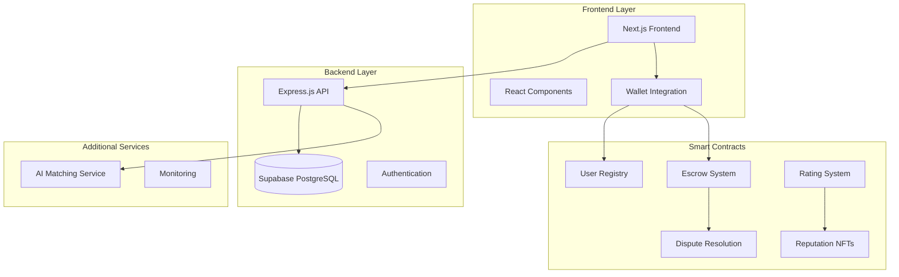

# 🚀 Offer Hub - Complete Platform Starter Guide

## Overview

Offer Hub is a comprehensive decentralized freelance platform that serves as a complete starter template for building blockchain-powered service marketplaces. This guide provides everything needed to deploy, customize, and scale your own freelance platform using our battle-tested architecture.

## 🏗️ Architecture Overview



## 🎯 What You Get

### ✅ Complete Frontend Application
- **Next.js 15** with React 19
- **TypeScript** for type safety
- **Tailwind CSS** for styling
- **Radix UI** components
- **Wallet integration** (Stellar, MetaMask, etc.)
- **Responsive design** for all devices
- **Real-time messaging** system
- **Payment interfaces**
- **Admin dashboard**

### ✅ Production-Ready Backend
- **Express.js** API with TypeScript
- **Supabase** PostgreSQL database
- **JWT authentication**
- **Rate limiting** and security
- **Standardized API responses**
- **Comprehensive error handling**
- **Database migrations**
- **RESTful API design**

### ✅ Smart Contract Suite
- **9 production-ready contracts** on Stellar/Soroban
- **Escrow system** with milestone payments
- **Dispute resolution** with mediation
- **User verification** and reputation
- **NFT rewards** for achievements
- **Fee management** system
- **Emergency controls**

### ✅ AI-Powered Matching Service
- **NestJS** microservice
- **Hugging Face** embeddings
- **OpenAI GPT-4** integration
- **Vector similarity search**
- **GraphQL API**
- **Redis caching**

## 🚀 Quick Start

### Prerequisites

```bash
# Required software
Node.js 18.x+
npm 8.x+
Docker (optional)
Git

# For smart contracts
Rust 1.70+
Soroban CLI
```

### 1. Clone and Setup

```bash
# Clone the repository
git clone https://github.com/OFFER-HUB/offer-hub.git
cd offer-hub

# Install frontend dependencies
npm install

# Install backend dependencies
cd backend && npm install && cd ..

# Install smart contract dependencies
cd contracts-offerhub && cargo build && cd ..
```

### 2. Environment Configuration

#### Frontend (.env.local)
```env
NEXT_PUBLIC_API_URL=http://localhost:4000
NEXT_PUBLIC_SUPABASE_URL=your_supabase_url
NEXT_PUBLIC_SUPABASE_ANON_KEY=your_supabase_anon_key
NEXT_PUBLIC_STELLAR_NETWORK=testnet
```

#### Backend (.env)
```env
PORT=4000
SUPABASE_URL=your_supabase_url
SUPABASE_SERVICE_ROLE_KEY=your_service_role_key
JWT_SECRET=your_jwt_secret
```

#### Smart Contracts
```bash
# Configure Soroban CLI
soroban config network add testnet \
  --rpc-url https://soroban-testnet.stellar.org:443/soroban/rpc \
  --network-passphrase "Test SDF Network ; September 2015"

# Generate admin account
soroban config identity generate admin
```

### 3. Database Setup

```bash
# Create Supabase project at https://supabase.com
# Link your project
cd backend
npx supabase login
npx supabase link --project-ref YOUR_PROJECT_REF

# Apply migrations
npx supabase db push
```

### 4. Deploy Smart Contracts

```bash
# Deploy all contracts
export ADMIN_ADDRESS="YOUR_ADMIN_ADDRESS"
./scripts/deploy-rating-system.sh
```

### 5. Start Development

```bash
# Terminal 1: Frontend
npm run dev

# Terminal 2: Backend
cd backend && npm run dev

# Terminal 3: AI Matching Service (optional)
cd services/freelance-matching && npm run start:dev
```

## 🎨 Customization Guide

### Frontend Customization

#### 1. Branding and Theme
```typescript
// src/app/globals.css
:root {
  --primary: 220 14.3% 95.9%;     /* Your primary color */
  --primary-foreground: 220.9 39.3% 11%;
  --secondary: 220 14.3% 95.9%;
  --secondary-foreground: 220.9 39.3% 11%;
  /* ... customize all colors */
}

// src/components/layout/Header.tsx
export default function Header() {
  return (
    <header className="bg-white shadow-sm">
      <div className="max-w-7xl mx-auto px-4">
        <div className="flex justify-between items-center py-4">
          
          {/* Customize navigation */}
        </div>
      </div>
    </header>
  );
}
```

#### 2. Custom Pages and Components
```typescript
// src/app/your-custom-page/page.tsx
export default function YourCustomPage() {
  return (
    <div className="container mx-auto py-8">
      <h1 className="text-3xl font-bold">Your Custom Page</h1>
      {/* Your custom content */}
    </div>
  );
}
```

#### 3. API Integration
```typescript
// src/services/api/your-service.ts
export class YourCustomService {
  static async getCustomData() {
    const response = await fetch('/api/your-endpoint');
    return response.json();
  }
}
```

### Backend Customization

#### 1. Add New API Endpoints
```typescript
// backend/src/routes/your-custom.routes.ts
import express from 'express';
import { YourCustomController } from '../controllers/your-custom.controller';

const router = express.Router();
const controller = new YourCustomController();

router.get('/custom-endpoint', controller.getCustomData);
router.post('/custom-endpoint', controller.createCustomData);

export default router;
```

#### 2. Database Schema Extensions
```sql
-- backend/supabase/migrations/add_your_table.sql
CREATE TABLE your_custom_table (
  id UUID PRIMARY KEY DEFAULT gen_random_uuid(),
  name TEXT NOT NULL,
  created_at TIMESTAMP DEFAULT NOW()
);
```

#### 3. Business Logic
```typescript
// backend/src/services/your-custom.service.ts
export class YourCustomService {
  async processCustomLogic(data: any) {
    // Your custom business logic
    return processedData;
  }
}
```

### Smart Contract Customization

#### 1. Add New Contract
```rust
// contracts-offerhub/contracts/your-contract/src/lib.rs
#![no_std]

use soroban_sdk::{contract, contractimpl, Env, Address};

#[contract]
pub struct YourContract;

#[contractimpl]
impl YourContract {
    pub fn your_function(env: Env, caller: Address) -> u32 {
        // Your contract logic
        42
    }
}
```

#### 2. Extend Existing Contracts
```rust
// Add new functions to existing contracts
pub fn your_new_feature(env: Env, caller: Address) -> Result<(), Error> {
    // Your new feature implementation
    Ok(())
}
```

## 🔧 Configuration Options

### Platform Settings

#### 1. Fee Structure
```typescript
// backend/src/config/fees.config.ts
export const FEE_CONFIG = {
  PLATFORM_FEE_PERCENTAGE: 3,      // 3% platform fee
  DISPUTE_FEE_PERCENTAGE: 5,       // 5% dispute fee
  PREMIUM_USER_DISCOUNT: 20,       // 20% discount for premium users
  MINIMUM_FEE: 1,                  // $1 minimum fee
};
```

#### 2. User Verification Levels
```typescript
// backend/src/config/verification.config.ts
export const VERIFICATION_LEVELS = {
  BASIC: {
    name: 'Basic',
    requirements: ['email', 'wallet'],
    benefits: ['basic_features']
  },
  PREMIUM: {
    name: 'Premium',
    requirements: ['email', 'wallet', 'kyc'],
    benefits: ['fee_discount', 'priority_support']
  },
  ENTERPRISE: {
    name: 'Enterprise',
    requirements: ['email', 'wallet', 'kyc', 'business_license'],
    benefits: ['fee_discount', 'priority_support', 'custom_features']
  }
};
```

#### 3. Dispute Resolution
```typescript
// backend/src/config/dispute.config.ts
export const DISPUTE_CONFIG = {
  MEDIATION_TIMEOUT_DAYS: 7,
  ARBITRATION_TIMEOUT_DAYS: 14,
  AUTO_RESOLUTION_TIMEOUT_DAYS: 30,
  MEDIATOR_FEE_PERCENTAGE: 2,
  ARBITRATOR_FEE_PERCENTAGE: 5,
};
```

### Frontend Configuration

#### 1. Feature Flags
```typescript
// src/config/features.config.ts
export const FEATURES = {
  ENABLE_CHAT: true,
  ENABLE_VIDEO_CALLS: false,
  ENABLE_AI_MATCHING: true,
  ENABLE_NFT_REWARDS: true,
  ENABLE_DISPUTE_RESOLUTION: true,
};
```

#### 2. UI Customization
```typescript
// src/config/ui.config.ts
export const UI_CONFIG = {
  PRIMARY_COLOR: '#3B82F6',
  SECONDARY_COLOR: '#64748B',
  SUCCESS_COLOR: '#10B981',
  ERROR_COLOR: '#EF4444',
  WARNING_COLOR: '#F59E0B',
  THEME: 'light', // 'light' | 'dark' | 'auto'
};
```

## 📊 Database Schema

### Core Tables

```sql
-- Users and Authentication
users (id, wallet_address, email, username, name, bio, is_freelancer, reputation_score, created_at)

-- Services and Projects
services (id, user_id, title, description, category, min_price, max_price, is_active, created_at)
projects (id, client_id, title, description, category, budget, status, created_at)

-- Applications and Contracts
applications (id, freelancer_id, project_id, proposal, bid_amount, status, created_at)
contracts (id, project_id, client_id, freelancer_id, amount, status, milestones, created_at)

-- Messaging System
conversations (id, project_id, client_id, freelancer_id, last_message_at, created_at)
messages (id, conversation_id, sender_id, content, message_type, file_url, is_read, created_at)

-- Reviews and Reputation
reviews (id, reviewer_id, reviewee_id, project_id, rating, comment, created_at)
nfts_awarded (id, user_id, nft_type, achievement, contract_address, token_id, created_at)
```

## 🔐 Security Features

### Authentication & Authorization
- **JWT-based authentication**
- **Wallet signature verification**
- **Role-based access control**
- **Rate limiting**
- **CORS protection**

### Smart Contract Security
- **Access control patterns**
- **Reentrancy protection**
- **Integer overflow checks**
- **Emergency pause functionality**
- **Multi-signature requirements**

### Data Protection
- **Input validation**
- **SQL injection prevention**
- **XSS protection**
- **CSRF tokens**
- **Secure headers**

## 🚀 Deployment Guide

### Production Deployment

#### 1. Frontend (Vercel/Netlify)
```bash
# Build for production
npm run build

# Deploy to Vercel
vercel --prod

# Or deploy to Netlify
netlify deploy --prod --dir=out
```

#### 2. Backend (Railway/Heroku/DigitalOcean)
```bash
# Build backend
cd backend
npm run build

# Deploy with your preferred platform
# Railway: railway deploy
# Heroku: git push heroku main
# DigitalOcean: docker build -t your-app .
```

#### 3. Database (Supabase)
```bash
# Production database setup
cd backend
npx supabase db push --project-ref YOUR_PROD_PROJECT_REF
```

#### 4. Smart Contracts (Stellar Mainnet)
```bash
# Deploy to mainnet
export NETWORK="mainnet"
export ADMIN_ADDRESS="YOUR_MAINNET_ADDRESS"
./scripts/deploy-rating-system.sh
```

### Docker Deployment

```dockerfile
# Dockerfile
FROM node:18-alpine

WORKDIR /app

# Copy package files
COPY package*.json ./
COPY backend/package*.json ./backend/

# Install dependencies
RUN npm ci
RUN cd backend && npm ci

# Copy source code
COPY . .

# Build applications
RUN npm run build
RUN cd backend && npm run build

# Expose ports
EXPOSE 3000 4000

# Start applications
CMD ["npm", "run", "start:prod"]
```

```yaml
# docker-compose.yml
version: '3.8'
services:
  frontend:
    build: .
    ports:
      - "3000:3000"
    environment:
      - NODE_ENV=production
  
  backend:
    build: ./backend
    ports:
      - "4000:4000"
    environment:
      - NODE_ENV=production
      - SUPABASE_URL=${SUPABASE_URL}
      - SUPABASE_SERVICE_ROLE_KEY=${SUPABASE_SERVICE_ROLE_KEY}
  
  matching-service:
    build: ./services/freelance-matching
    ports:
      - "3001:3001"
    environment:
      - NODE_ENV=production
```

## 📈 Scaling Considerations

### Performance Optimization

#### 1. Database Optimization
```sql
-- Add indexes for better performance
CREATE INDEX idx_users_reputation ON users(reputation_score DESC);
CREATE INDEX idx_projects_status ON projects(status, created_at DESC);
CREATE INDEX idx_messages_conversation ON messages(conversation_id, created_at);
```

#### 2. Caching Strategy
```typescript
// Redis caching for frequently accessed data
import Redis from 'ioredis';

const redis = new Redis(process.env.REDIS_URL);

export class CacheService {
  static async get(key: string) {
    return await redis.get(key);
  }
  
  static async set(key: string, value: any, ttl: number = 3600) {
    return await redis.setex(key, ttl, JSON.stringify(value));
  }
}
```

#### 3. CDN Configuration
```typescript
// next.config.js
module.exports = {
  images: {
    domains: ['your-cdn-domain.com'],
    loader: 'custom',
    loaderFile: './src/lib/imageLoader.js',
  },
  assetPrefix: process.env.NODE_ENV === 'production' ? 'https://your-cdn-domain.com' : '',
};
```

### Monitoring and Analytics

#### 1. Application Monitoring
```typescript
// backend/src/middlewares/monitoring.middleware.ts
import { Request, Response, NextFunction } from 'express';

export const monitoringMiddleware = (req: Request, res: Response, next: NextFunction) => {
  const start = Date.now();
  
  res.on('finish', () => {
    const duration = Date.now() - start;
    console.log(`${req.method} ${req.path} - ${res.statusCode} - ${duration}ms`);
    
    // Send to monitoring service (DataDog, New Relic, etc.)
    // monitoringService.recordMetric('api.duration', duration);
  });
  
  next();
};
```

#### 2. Smart Contract Monitoring
```rust
// Add events to contracts for monitoring
pub fn your_function(env: Env, caller: Address) -> Result<(), Error> {
    // Your logic here
    
    // Emit event for monitoring
    env.events().publish(
        (Symbol::new(&env, "function_called"), caller.clone()),
        env.ledger().timestamp()
    );
    
    Ok(())
}
```

## 🛠️ Development Workflow

### Code Organization

```
offer-hub/
├── src/                          # Frontend (Next.js)
│   ├── app/                      # App Router pages
│   ├── components/               # Reusable components
│   ├── hooks/                    # Custom React hooks
│   ├── services/                 # API services
│   ├── types/                    # TypeScript types
│   └── utils/                    # Utility functions
├── backend/                      # Backend API (Express.js)
│   ├── src/
│   │   ├── controllers/          # Route handlers
│   │   ├── services/             # Business logic
│   │   ├── routes/               # API routes
│   │   ├── middlewares/          # Express middlewares
│   │   └── utils/                # Backend utilities
│   └── supabase/
│       └── migrations/           # Database migrations
├── contracts-offerhub/           # Smart contracts (Rust/Soroban)
│   ├── contracts/
│   │   ├── user-registry-contract/
│   │   ├── escrow-contract/
│   │   ├── dispute-contract/
│   │   └── ...                   # Other contracts
│   └── test/                     # Contract tests
├── services/                     # Additional microservices
│   └── freelance-matching/       # AI matching service
└── docs/                         # Documentation
```

### Testing Strategy

#### 1. Frontend Testing
```typescript
// src/components/__tests__/Button.test.tsx
import { render, screen } from '@testing-library/react';
import { Button } from '../Button';

test('renders button with text', () => {
  render(<Button>Click me</Button>);
  expect(screen.getByText('Click me')).toBeInTheDocument();
});
```

#### 2. Backend Testing
```typescript
// backend/src/__tests__/user.controller.test.ts
import request from 'supertest';
import app from '../index';

describe('User Controller', () => {
  test('GET /api/users should return users', async () => {
    const response = await request(app)
      .get('/api/users')
      .expect(200);
    
    expect(response.body.success).toBe(true);
  });
});
```

#### 3. Smart Contract Testing
```rust
// contracts-offerhub/contracts/your-contract/src/test.rs
#[test]
fn test_your_function() {
    let env = Env::default();
    let contract_id = env.register_contract(None, YourContract);
    let client = YourContract::new(&env, &contract_id);
    
    let caller = Address::generate(&env);
    let result = client.your_function(&caller);
    
    assert_eq!(result, 42);
}
```

## 🔄 Integration Examples

### Third-Party Integrations

#### 1. Payment Processors
```typescript
// src/services/payments/stripe.service.ts
import Stripe from 'stripe';

export class StripeService {
  private stripe = new Stripe(process.env.STRIPE_SECRET_KEY!);
  
  async createPaymentIntent(amount: number, currency: string) {
    return await this.stripe.paymentIntents.create({
      amount: amount * 100, // Convert to cents
      currency,
    });
  }
}
```

#### 2. Email Services
```typescript
// backend/src/services/email.service.ts
import nodemailer from 'nodemailer';

export class EmailService {
  private transporter = nodemailer.createTransporter({
    service: 'gmail',
    auth: {
      user: process.env.EMAIL_USER,
      pass: process.env.EMAIL_PASS,
    },
  });
  
  async sendWelcomeEmail(to: string, name: string) {
    await this.transporter.sendMail({
      from: process.env.EMAIL_USER,
      to,
      subject: 'Welcome to Your Platform!',
      html: `<h1>Welcome ${name}!</h1>`,
    });
  }
}
```

#### 3. Analytics Integration
```typescript
// src/lib/analytics.ts
import { Analytics } from '@vercel/analytics/react';

export const trackEvent = (event: string, properties?: any) => {
  Analytics.track(event, properties);
};

// Usage in components
export default function ProjectCard({ project }: { project: Project }) {
  const handleClick = () => {
    trackEvent('project_viewed', { projectId: project.id });
  };
  
  return (
    <div onClick={handleClick}>
      {/* Project card content */}
    </div>
  );
}
```

## 📚 API Documentation

### Core Endpoints

#### Authentication
```typescript
POST /api/auth/login
POST /api/auth/register
POST /api/auth/refresh
POST /api/auth/logout
```

#### Users
```typescript
GET /api/users
GET /api/users/:id
PUT /api/users/:id
DELETE /api/users/:id
```

#### Projects
```typescript
GET /api/projects
POST /api/projects
GET /api/projects/:id
PUT /api/projects/:id
DELETE /api/projects/:id
```

#### Messages
```typescript
GET /api/conversations
POST /api/conversations
GET /api/conversations/:id/messages
POST /api/conversations/:id/messages
```

### Smart Contract Functions

#### User Registry
```rust
pub fn register_user(env: Env, caller: Address, user_data: UserData) -> Result<(), Error>
pub fn verify_user(env: Env, caller: Address, user_id: Address, level: u32) -> Result<(), Error>
pub fn get_user_status(env: Env, user_id: Address) -> Result<UserStatus, Error>
```

#### Escrow Contract
```rust
pub fn deposit_funds(env: Env, caller: Address, amount: i128) -> Result<(), Error>
pub fn release_funds(env: Env, caller: Address, milestone_id: u32) -> Result<(), Error>
pub fn create_milestone(env: Env, caller: Address, milestone: MilestoneData) -> Result<u32, Error>
```

## 🎯 Use Cases and Examples

### 1. Freelance Marketplace
Perfect for platforms like Upwork, Fiverr, or Toptal alternatives.

### 2. Service Marketplaces
Ideal for home services, consulting, or professional services.

### 3. Gig Economy Platforms
Suitable for delivery services, task-based work, or on-demand services.

### 4. Creative Marketplaces
Great for design, writing, or creative service platforms.

### 5. Technical Services
Perfect for software development, IT services, or technical consulting.

## 🆘 Support and Community

### Getting Help
- **Documentation**: Check the `/docs` folder for detailed guides
- **Issues**: Open GitHub issues for bugs or feature requests
- **Discussions**: Use GitHub Discussions for questions
- **Discord**: Join our community Discord server

### Contributing
- Fork the repository
- Create a feature branch
- Make your changes
- Add tests
- Submit a pull request

### License
This project is licensed under the MIT License - see the LICENSE file for details.

## 🚀 Next Steps

1. **Fork the repository** and customize it for your needs
2. **Set up your development environment** following this guide
3. **Deploy to your preferred platform** using our deployment guides
4. **Customize the branding and features** to match your vision
5. **Add your own business logic** and integrations
6. **Launch your platform** and start serving users!

---

**Ready to build the next generation of freelance platforms?** 🚀

This starter provides everything you need to launch a production-ready, blockchain-powered service marketplace. The modular architecture allows you to customize every aspect while maintaining the robust foundation that powers successful platforms.

Start building today and join the decentralized economy! 🌟
